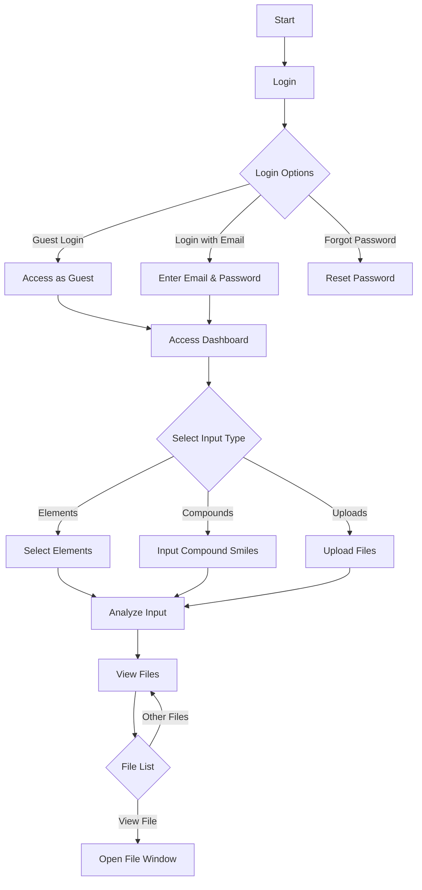

```mermaid
    flowchart TD
    A[Start] --> B[Login]
    B --> C{Login Options}
    C -->|Guest Login| D[Access as Guest]
    C -->|Login with Email| E[Enter Email & Password]
    C -->|Forgot Password| F[Reset Password] 
    D --> G[Access Dashboard]
    E --> G[Access Dashboard]
    

    G --> H{Select Input Type}
    H -->|Elements| I[Select Elements]
    H -->|Compounds| J[Input Compound Smiles]
    H -->|Uploads| K[Upload Files]

    I --> L[Analyze Input]
    J --> L
    K --> L

    L --> M[View Files]
    M --> N{File List}
    N -->|View File| O[Open File Window]
    N -->|Other Files| M

```