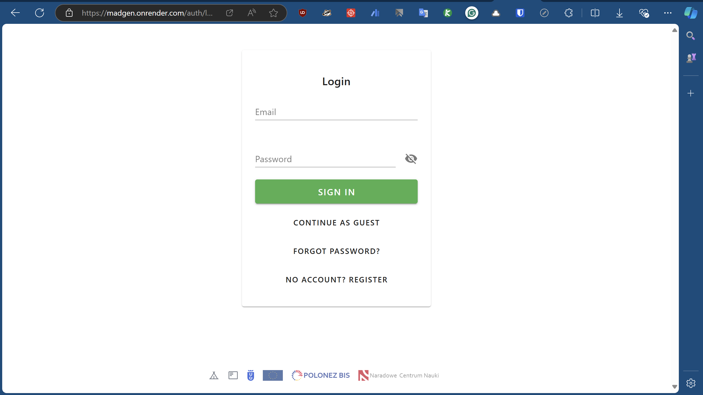
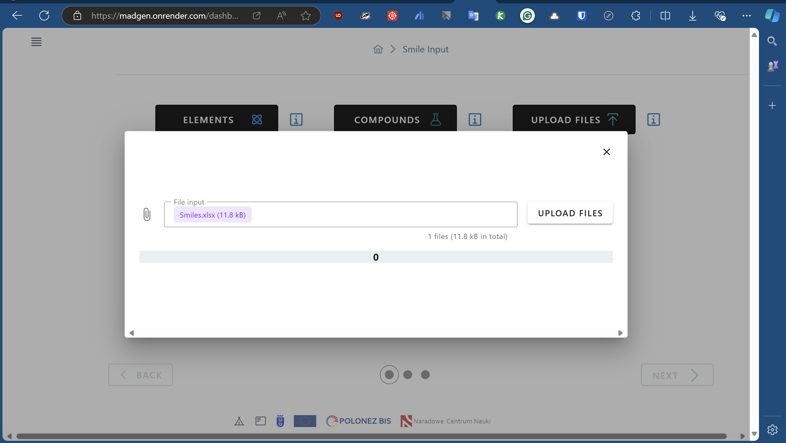
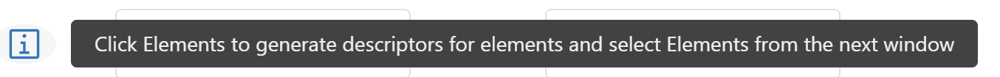

### Home Page:
When you open the website, you will be directed to the home page, which has two options:

- **Tutorial**: This will direct you to this documentation page. (If you are seeing this page, you already know what that button does.)
- **Start**: This will direct you to the login page.

### Login
The typical login page allows you to log in with your email ID or as a guest.  
  
For now, we strongly recommend using guest login (**CONTINUE AS GUEST**) or logging in with a temporary email ID (you can use temporary mail services). We’d love to see how logging in with an email ID works, so if you want to join our experiment, you are free to do so.

!!! warning "Remember"
    **Please note that all files will be deleted 1 hour after login. If you are still using the site after 1 hour, please log out and log in again (currently, we have not implemented auto-logout).**

### Dashboard
Once you are logged in, you will be directed to the dashboard.  
  
The page is about **SMILES** input. Here we have three options:

- **Elemental**: To input elemental SMILES, a periodic table will open, allowing you to select elements and click submit (only elements are allowed at this stage).  
  {:height="50%" width="50%" align="right" loading="lazy"}  
  The image on the right is the periodic table. You can select elements by clicking on them. After selecting the elements, click "Submit."

!!! info "Info"
    Currently, only elements can be selected (multiple elements are allowed), but formulas are not allowed. For example, if you select C and O, it will be considered as elemental Carbon and Oxygen, not as Carbon Monoxide.

- **Compound SMILES**: To input SMILES of individual compounds. For example, Methane (CH₄) would be entered as `[H]C([H])([H])[H]`. After each entry, press enter.  
  {:height="50%" width="50%" align="left" loading="lazy"}  
  When an entry is recorded, you will see a green shade around the SMILES. In the image on the left, we entered three SMILES. After each SMILES entry, press enter and then input the next SMILES (one by one). When finished, click the submit button.

---
- **Upload Files**: You can upload CSV or XLSX files. Files should have a header column named "Smiles."  
  {:height="20px" width="110px" align="right" loading="lazy"}  
  The image on the right shows a sample file. The header in row 1 should be exactly "Smiles."  
  {:height="50%" width="50%" align="left" loading="lazy"}  
  Click "Choose File" to select a file from your computer. After selecting the file, click "Submit."

!!! tip "Multiple Inputs"
    In the above image, you can see that all three options are in black, meaning they are selected. You can use all three inputs at the same time.

___

!!! info "Info"
    You may see the info icon (:material-information-box-outline:). On mobile, tap it, and on a personal computer, hover over it to see additional tips or information, like this:
    

### Step 3: Analyze
After inputting your data, click "Analyze" to process the files. If everything is correct, a green checkmark will appear next to each button.

### Step 4: Fix Errors
If there are any errors:
- Click "View Files" to open the file and check for entries in the "SmilesError" column.
- If there are entries in "SmilesError," there is an issue with those SMILES. Correct the SMILES by clicking in the "Smiles" cell (not in "SmilesError") and editing the SMILES. Press "Update Smiles."
- After closing the dialog, press "Analyze" again. If everything is correct, a checkmark will appear next to the corresponding input.

### Step 5: Descriptor Selection
- Select either "First Gen," "Second Gen," or "Both."
- Click "Externals" if you want to generate descriptors, or choose "RDKit" or "PubChem" (note: these options may be very slow).

### Step 6: Click Calculate

### Step 7: Download Files
- Click "Download All Files" to download your files, or "Show Files" to view the files.

## Reminder
This is a beta version. Please avoid uploading large files, as this is deployed on a resource-limited platform.
